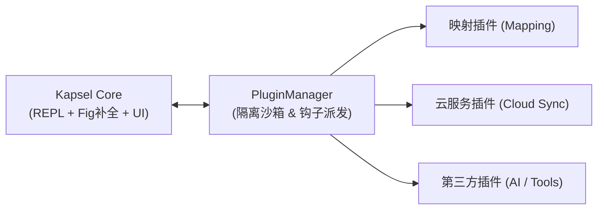

# 💊 Kapsel 插件开发规范 (Plugin Specification)

本文档定义 Kapsel 微内核架构下的插件开发标准、生命周期、扩展点钩子（Hooks）以及宿主交互 API。

---

## 1. 架构总览

Kapsel 采用**微内核 + 插件化总线**设计：
* **核心（Core）**：仅保留极简的终端交互（REPL）、核心自动补全引擎（Fig AST）、现代化终端 UI（卡片、主题、横幅）以及本地基础持久化。
* **插件（Plugins）**：映射翻译器、云同步与漫游、AI 解释、第三方包管理等均作为可插拔的模块运行。



---

## 2. 插件目录与结构规范

每个 Kapsel 插件应为一个独立的目录，放置于工作区的 `./plugins/<plugin_id>/` 或用户主目录 `~/.kapsel/plugins/<plugin_id>/` 下：

```text
plugins/my_plugin/
├── __init__.py           # 插件入口，导出继承自 KapselPlugin 的类
├── manifest.yaml         # 可选：独立元数据配置文件
└── ...                   # 插件私有业务代码
```

---

## 3. 核心接口与元数据

### 3.1 插件基类 `KapselPlugin`
所有插件必须继承 `kapsel.core.plugin.base.KapselPlugin`，并提供元数据：

```python
from kapsel.core.plugin.base import KapselPlugin, PluginManifest
from kapsel.core.plugin.context import PluginContext

class MyPlugin(KapselPlugin):
    manifest = PluginManifest(
        id="my_plugin",
        name="我的示例插件",
        version="1.0.0",
        description="演示 Kapsel 插件基本生命周期与扩展功能",
        author="Kapsel Developer",
        min_kapsel_version="0.1.0",
    )

    def on_load(self, context: PluginContext) -> None:
        """插件挂载入口：注册指令、挂载事件钩子"""
        pass

    def on_unload(self) -> None:
        """插件卸载清理：释放文件句柄、网络连接等"""
        pass

# 导出 Plugin 类作为入口约定
Plugin = MyPlugin
```

---

## 4. 宿主上下文 API (`PluginContext`)

在 `on_load(context)` 中，宿主会注入一个受控的上下文对象 `PluginContext`：

| 方法 / 属性 | 类型 | 描述 |
| :--- | :--- | :--- |
| `context.register_kps_command(...)` | 方法 | 注册新的 `kps <name>` 指令，**自动同时注入补全菜单与 CLI 执行路由** |
| `context.register_hook(hook_type, cb)` | 方法 | 监听或挂载到特定的核心生命周期钩子 |
| `context.plugin_data_dir` | 属性 (`Path`) | 获取该插件专属的隔离存储目录（位于 `~/.kapsel/plugins_data/<plugin_id>/`） |
| `context.environment` | 属性 | 探测到的宿主操作系统（`system`）、当前 Shell（`shell`）、提权状态（`is_elevated`）等 |
| `context.logger` | 属性 | 宿主全局统一日志记录器 |

### 4.1 注册统一指令示例
```python
def handle_hello(args, console):
    console.print("[bold #00f0ff]Hello from MyPlugin![/]")
    return 0

context.register_kps_command(
    name="hello",
    handler=handle_hello,
    help_text="向终端打印问候信息",
    subcommands={"world": "打印世界问候"},
    usage="kps hello [world]",
)
```

---

## 5. 核心钩子规范 (`HookType`)

通过 `context.register_hook(HookType.XXX, callback)` 可以扩展内核行为：

### 5.1 `FILTER_COMMAND` (命令预处理 / 转译拦截器)
* **执行时机**：用户在终端按下回车后、真正执行底层指令前。
* **签名**：`(raw_command: str) -> Tuple[bool, str]`
* **说明**：如果插件需要转译或接管命令（如原有的 Linux 跨平台映射插件），返回 `(True, translated_cmd)`，内核将转而执行转译后的命令。

### 5.2 `PROVIDE_COMPLETIONS` (补全候选项注入)
* **执行时机**：用户在输入框打字或按下 Tab 键时。
* **签名**：`(text_before_cursor: str) -> List[dict]`
* **返回候选字典格式**：
  ```python
  [
      {
          "text": "补全插入文本",
          "display": "菜单显示文本",
          "display_meta": "右侧说明/图标",
          "start_position": -len(query), # 可选
      }
  ]
  ```

### 5.3 `ON_AFTER_EXECUTE` (执行后处理)
* **执行时机**：任何原生命令或胶囊命令在终端执行完成后触发。
* **签名**：`(command: str, exit_code: int, duration_ms: float) -> None`
* **适用场景**：云同步插件异步记录命令漫游历史、性能度量插件上报等。

---

## 6. 从 `temp/` 迁移现有功能的插件化范例

### 示例 A：将 `temp/mapping` 包装为映射插件
```python
# plugins/mapping/__init__.py
from kapsel.core.plugin.base import KapselPlugin, PluginManifest
from kapsel.core.plugin.context import PluginContext
from kapsel.core.plugin.hooks import HookType

# 从 temp 或重构后的包引入路由逻辑
from .router import CommandRouter

class MappingPlugin(KapselPlugin):
    manifest = PluginManifest(
        id="mapping",
        name="Linux-First 跨平台命令映射插件",
        version="1.0.0",
        description="将熟悉的 Linux 指令自动翻译为宿主原生 Shell 指令并执行",
    )

    def on_load(self, context: PluginContext) -> None:
        self.router = CommandRouter(shell_type=context.environment.shell)
        context.register_hook(HookType.FILTER_COMMAND, self.filter_command)
        context.register_hook(HookType.PROVIDE_COMPLETIONS, self.provide_completions)

    def filter_command(self, raw_command: str):
        if raw_command.startswith("kps "):
            sub = raw_command[4:].strip()
            # 翻译指令
            translated = self.router.translate(sub)
            if translated:
                return True, translated
        return False, raw_command

    def provide_completions(self, text_before_cursor: str):
        if text_before_cursor.startswith("kps "):
            query = text_before_cursor[4:]
            return self.router.get_completions(query)
        return []

Plugin = MappingPlugin
```

### 示例 B：将 `temp/cloud` 包装为云服务插件
```python
# plugins/cloud/__init__.py
from kapsel.core.plugin.base import KapselPlugin, PluginManifest
from kapsel.core.plugin.context import PluginContext
from kapsel.core.plugin.hooks import HookType

class CloudPlugin(KapselPlugin):
    manifest = PluginManifest(
        id="cloud",
        name="Kapsel 云服务与漫游同步插件",
        version="1.0.0",
        description="支持用户注册、跨设备身份漫游与云端同步",
    )

    def on_load(self, context: PluginContext) -> None:
        # 向核心注册子命令：kps login, kps sync, kps repo
        context.register_kps_command("login", self.handle_login, "登录 Kapsel 漫游账号")
        context.register_kps_command("sync", self.handle_sync, "手动触发多端配置同步")
        context.register_hook(HookType.ON_AFTER_EXECUTE, self.on_command_finished)

    def handle_login(self, args, console):
        console.print("[dim]正在连接 KPS-Server...[/]")
        return 0

    def handle_sync(self, args, console):
        console.print("[dim]同步完成[/]")
        return 0

    def on_command_finished(self, command: str, exit_code: int, duration_ms: float):
        # 异步漫游上传历史记录
        pass

Plugin = CloudPlugin
```
