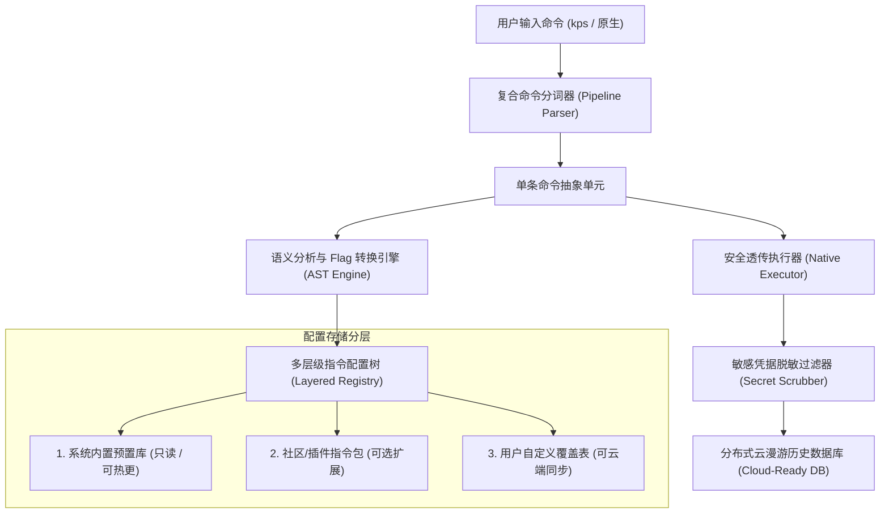

# 💊 Kapsel 指令存储与指令映射架构深度分析与优化方案

本文档针对 Kapsel 当前的**指令存储机制**（History & Weights Storage）与**指令映射机制**（Command Mapping & Routing）进行系统化剖析，诊断现有架构的瓶颈与痛点，并提出面向现代化终端体验与未来**“云端多系统同步”**的完整优化演进方案。

---

## 一、 当前实现机制深度剖析

### 1.1 指令映射体系 (Command Mapping)

当前代码位于 `kapsel/storage/commands.py` 与 `kapsel/core/router.py`。

#### (1) 物理存储格式
- **外部存储路径**：`~/.kapsel/commands.yaml`（在首次启动时由 `commands.py` 从内置预置列表导出）。
- **内置基线数据**：`DEFAULT_COMMANDS` 列表，当前预置了 36+ 条高频 Linux-First 核心指令（如 `rm -rf`、`ls -la`、`cat`、`touch`、`ps`、`kill -9`、`grep`、`df -h` 等）。
- **存储数据结构**：
  ```yaml
  rm -rf:
    desc: "递归强制删除目录或文件"
    mapping:
      powershell: "Remove-Item -Recurse -Force {{args}}"
      cmd: "rmdir /S /Q {{args}}"
      unix: "rm -rf {{args}}"
  ```

#### (2) 运行时内存模型 (`CommandRegistry`)
- 启动时全量加载 YAML 内容为 `Dict[str, CommandEntry]`，键名为别名 `alias`。
- `CommandEntry` 包含：
  - `alias`: 指令前缀（如 `rm -rf`、`ls`）
  - `desc`: 中文说明
  - `mapping`: 各平台 Shell 的原生命令模版（支持 `powershell`、`pwsh`、`cmd`、`bash`、`zsh`、`fish`、`unix`）

#### (3) 路由与参数填充算法 (`CommandRouter`)
- **最长前缀贪婪匹配 (`find_best_match`)**：
  在输入的命令体中，按别名字符长度降序遍历匹配（例如同时存在 `rm` 和 `rm -rf` 时，优先匹配长度更长的 `rm -rf`）。
- **文本宏替换**：
  截取匹配别名之后的剩余字符串作为 `{{args}}`，直接做字符串级别的 `template.replace("{{args}}", raw_args)`。
- **多级平台降级逻辑**：
  若当前终端为 `pwsh`，寻找顺序为：`pwsh` ➜ `powershell` ➜ `posix / unix`；CMD 则寻找 `cmd` ➜ `unix`。

---

### 1.2 指令历史与频次存储体系 (History & Weight Storage)

当前代码位于 `kapsel/storage/history.py`。

#### (1) 物理存储介质
- 采用轻量嵌入式关系型数据库 **SQLite 3**，存储于沙箱隔离路径 `~/.kapsel/history.db`。

#### (2) 核心数据表结构
1. **`history` 表（命令全量时序记录）**：
   ```sql
   CREATE TABLE history (
       id INTEGER PRIMARY KEY AUTOINCREMENT,
       command TEXT NOT NULL,          -- 原始用户输入
       translated_cmd TEXT,           -- 转换后的真实宿主命令
       mode TEXT NOT NULL,             -- 执行模式: native 或 kapsel
       cwd TEXT NOT NULL,              -- 执行时所在工作目录
       shell TEXT NOT NULL,            -- 执行时的宿主 Shell (如 pwsh)
       timestamp REAL NOT NULL,        -- 高精度浮点时间戳
       duration_ms INTEGER,            -- 执行耗时 (毫秒)
       exit_code INTEGER               -- 进程退出状态码 (0 为成功)
   );
   ```
2. **`command_weights` 表（高频权重学习库）**：
   ```sql
   CREATE TABLE command_weights (
       alias TEXT PRIMARY KEY,         -- 指令名称
       count INTEGER DEFAULT 1,        -- 累计使用次数
       last_used REAL NOT NULL         -- 最近使用时间戳
   );
   ```

#### (3) 运行时交互
- **输入联动**：每次执行命令后，异步/无阻塞地写入 `history` 表，并在 `command_weights` 中递增 `count`。
- **补全排序**：在候选菜单弹出时，自动关联 `command_weights` 对匹配候选按使用频次加权排序，越常用的命令排得越前。

---

### 1.3 常用 CLI 工具子命令补全现状 (`completer.py`)
- 当前在 `kapsel/ui/completer.py` 中以 Python 静态字典 `CLI_SUBCOMMANDS` 的形式，内嵌了 `git`、`npm`、`docker`、`pip`、`cargo` 等主流工具的子命令及中文说明。

---

## 二、 核心痛点与架构瓶颈诊断

虽然目前的实现架构清晰、启动速度极快（单次加载 < 15ms），但在应对复杂命令行场景与未来云端多系统漫游时，暴露出以下深层次瓶颈：

| 维度 | 现状缺陷 | 典型踩坑场景 / 恶劣后果 |
| :--- | :--- | :--- |
| **参数语法分析** | 仅依赖字符串最长前缀与粗暴的 `{{args}}` 替换，**缺乏命令行 AST 语法树解析** | 输入 `rm -r -f file` 无法匹配 `rm -rf`，只能匹配到普通 `rm`；导致参数未能正确转义。 |
| **Flag 选项映射** | **无法对单个参数标志位进行平台翻译** | Linux 下的 `grep -i "abc"` 无法智能转换为 PowerShell 的 `Select-String -CaseSensitive:$false`。 |
| **配置分层隔离** | 系统预置指令与用户自定义指令混存在单个 `commands.yaml` 中 | 当 Kapsel 发布新版本新增预置指令时，覆盖文件会抹掉用户的自定义改动，不覆盖则用户无法享受新特性。 |
| **管道与复合命令** | **不支持 `\|`、`&&`、`;` 复合语句的分段解析** | 输入 `kps cat test.txt \| grep error` 时，整个管道语句被当作参数传给 `cat` 的转义模板，导致执行语法报错。 |
| **云端同步准备** | SQLite 采用递增整型 `id INTEGER PRIMARY KEY`，**无分布式协同字段** | 多个系统（如 Mac 和 PC）的历史记录向云端合并时，会产生严重的自增 ID 冲突和覆盖混乱。 |
| **安全隐私防线** | 历史记录全量明文落盘，**缺少敏感信息脱敏过滤器** | 用户执行 `curl -H "Authorization: Bearer <TOKEN>"` 或输入带密码的命令被原样存盘并同步，存在严重泄露风险。 |
| **路径分隔符** | 参数路径未作 OS 语义对齐 | Linux 惯用的正斜杠 `/` 在透传给 Windows `cmd /c rmdir` 等老旧原生命令时，会被 Windows 误判为指令选项。 |

---

## 三、 全方位优化方案设计 (Optimization Architecture)

针对上述痛点，我们设计了以下四大核心优化引擎与架构改造方案：



---

### 优化 1：参数语义抽象与智能 Flag 转换引擎 (Semantic Flag Engine)

将目前的“简单字符串宏替换”演进为“**轻量 POSIX 语法解析器**”：

1. **短参数拆合归一化**：
   无论用户输入 `rm -rf`、`rm -r -f`、`rm -fr` 还是 `rm --recursive --force`，解析器统一将其归一化为核心指令 `rm` + 抽象选项集合 `[RECURSIVE, FORCE]`。
2. **Flag 语义映射表 Schema**：
   在 `commands.yaml` 中允许声明参数标志位映射规则：
   ```yaml
   grep:
     desc: "文本搜索匹配"
     mapping:
       powershell: "Select-String {{flags}} {{args}}"
       cmd: "findstr {{flags}} {{args}}"
     flags_map:
       "-i":
         powershell: "-CaseSensitive:$false"
         cmd: "/I"
       "-n":
         powershell: ""  # PowerShell 默认带行号
         cmd: "/N"
       "-v":
         powershell: "-NotMatch"
         cmd: "/V"
   ```
3. **参数类型感知与路径转义**：
   自动识别参数中的文件路径，针对当前运行的目标 Shell（如 CMD 需要 `\`，PowerShell / Unix 支持 `/`）自动做斜杠与引号规范化。

---

### 优化 2：多层级指令配置体系 (Layered Mapping Cascades)

彻底解耦系统指令与用户指令，建立清晰的三层加载覆盖体系：

1. **Layer 1: 系统核心预置 (System Presets)**
   - 打包随 Python 库分发（例如 `kapsel/assets/presets.yaml`），保证只读与原生命令基线体验。
2. **Layer 2: 社区生态/工具链包 (Extension Packs)**
   - 例如 `~/.kapsel/packs/docker.yaml`、`~/.kapsel/packs/k8s.yaml`，按需开启。
3. **Layer 3: 用户自定义与覆盖层 (User Overrides)**
   - 存储于 `~/.kapsel/custom_commands.yaml`。
   - 用户定义的同名指令拥有最高优先级，只同步这一份轻量 YAML 到云端，升级 Kapsel 版本绝不丢失用户自定义配置。

---

### 优化 3：复合管道命令分解路由 (Pipeline & Redirection Aware)

增强 `CommandRouter` 对 Shell 语法元字符（`|`、`>`、`>>`、`&&`、`;`）的感知能力：
1. **词法切片**：
   例如 `kps cat file.txt | grep -i "error"`：
   - 识别出管道符 `|`；
   - 分解为第一段 `cat file.txt` ➔ 映射转义为 `Get-Content file.txt`；
   - 分解为第二段 `grep -i "error"` ➔ 映射转义为 `Select-String -CaseSensitive:$false "error"`；
   - 用原生宿主管道重新组装为：`Get-Content file.txt | Select-String -CaseSensitive:$false "error"`。

---

### 优化 4：面向云同步的分布式存储重构 (Cloud-Sync Ready Storage)

为了支持后续多台电脑（Windows 11、MacBook M系列、Ubuntu 服务器）之间无缝漫游，对 `history.db` 进行分布式模式升级：

#### (1) 引入 UUIDv4 与设备版本向量 (Vector / Version Timestamp)
```sql
ALTER TABLE history ADD COLUMN uuid TEXT UNIQUE;           -- 全局唯一记录 ID (UUIDv4)
ALTER TABLE history ADD COLUMN device_id TEXT;              -- 来源设备指纹 (匹配 user.json 中的 dev_id)
ALTER TABLE history ADD COLUMN updated_at REAL;             -- 最后修改时间戳
ALTER TABLE history ADD COLUMN is_deleted INTEGER DEFAULT 0;-- 墓碑标记 (软删除，用于同步删除事件)
ALTER TABLE history ADD COLUMN sync_state INTEGER DEFAULT 0;-- 同步状态: 0未同步, 1已同步, 2冲突
```

#### (2) 增量变更流水日志 (`history_changelog`)
新增增量流水表，每次本地变更记录一条 Changelog，向云端同步时仅需比对 `last_sync_seq` 序号，极大降低云端网络传输负载。

---

### 优化 5：敏感凭据脱敏过滤器 (Secret Scrubbing Engine)

在历史记录写入数据库及上传云端之前，执行统一的敏感信息过滤管道：
1. **模式特征匹配**：
   - 匹配常见云凭据：`AKIA[0-9A-Z]{16}` (AWS)、`ghp_[a-zA-Z0-9]{36}` (GitHub Token)
   - 匹配 Bearer Token：`Bearer\s+[a-zA-Z0-9\-\._~\+\/]+=*`
   - 匹配常用密码参数：`-p\s+([^\s]+)`、`--password\s+([^\s]+)`
2. **自动掩码处理**：
   将敏感文本脱敏为 `ghp_******` 或 `[REDACTED_SECRET]`，避免敏感凭证在云端存储或终端漫游中泄露。

---

### 优化 6：SQLite FTS5 全文检索与高频 LRU 内存缓存

1. **启用 SQLite FTS5 (Full-Text Search 5)**：
   为 `history` 表创建虚拟全文索引表，支持拼音前缀、驼峰缩写以及模糊子串搜索，即使在积累 50 万条命令后，依然保持 < 1ms 的检索响应。
2. **两级热点缓存 (Memory LRU Cache)**：
   将使用频次最高的前 100 条指令保存在内存中，方向键漫游和行内预测直接命中内存，消除磁盘 IO 开销。

---

## 四、 实施落地路线图 (Implementation Roadmap)

| 阶段 | 实施内容 | 达成目标与价值 |
| :---: | :--- | :--- |
| **Phase 1**<br>(基础加固) | • 将用户自定义配置与系统预置拆分为 `custom_commands.yaml`<br>• 在 `history.db` 中预埋 `uuid`、`device_id` 和 `sync_state` 字段 | 彻底解决版本升级覆盖问题，完成云同步数据库基建 |
| **Phase 2**<br>(语义增强) | • 引入轻量参数解析器，支持 `rm -r -f` 归一化<br>• 实现 `flags_map` 机制，首批落地 `grep`、`ls`、`ps` 参数智能转义 | 大幅降低 Windows 用户使用复杂 Linux 参数时的割裂感 |
| **Phase 3**<br>(安全与管道) | • 增加敏感 Token 自动正则脱敏机制<br>• 实现简单的 `\|` 管道与 `&&` 连接符分段识别转义 | 消除历史明文泄露风险，支持管道级指令胶囊化 |
| **Phase 4**<br>(云端漫游) | • 配合 `user.json` 中的 `sync_key`，实现与云端 API 的加密增量同步协议<br>• 支持 Windows ⇋ macOS ⇋ Linux 全平台配置/历史秒级同步 | 真正实现“一次配置，所有终端漫游”的终极产品愿景 |

---

> 💡 **总结**：
> 当前 Kapsel 的存储与映射引擎做到了“极致轻量”与“零启动延迟”；通过引入**参数语义树抽象**、**配置分级隔离**与**分布式同步字段**，Kapsel 将从一个单机终端转换器，真正跃迁为跨平台的自适应终端操作系统胶囊。
