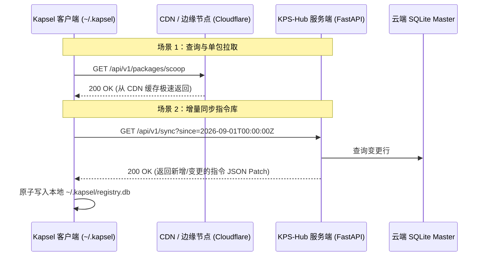
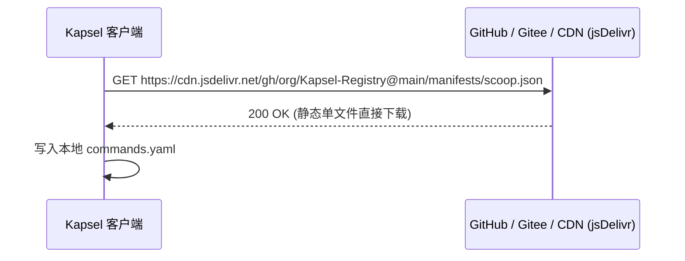
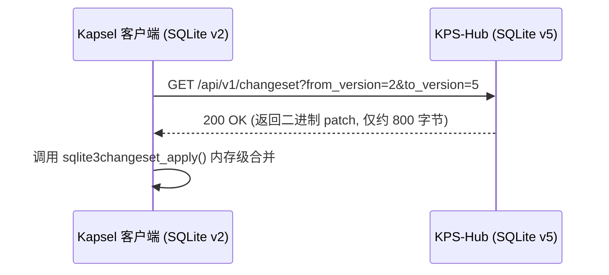

# 📡 Kapsel 本地与云端通信方案调研与架构选型报告

> **编制说明**：
> 本文档旨在为 Kapsel 终端胶囊（客户端）与 KPS-Hub（云端指令仓库/用户漫游服务）设计最健壮、最高效、且适应不同阶段业务发展的通信架构。
> 结合现代包管理器（pip、scoop、brew、cargo）与跨端同步工具的技术精髓，提出五套备选通信方案，并对优缺点、成本、网络穿透与工程复杂度进行全方位对比。

---

## 目录
1. [方案一：标准 RESTful API + JSON/MsgPack 增量同步 (现代工业级标准)](#方案一标准-restful-api--jsonmsgpack-增量同步)
2. [方案二：Git-Based 静态去中心化托管 (零服务器成本开源模式)](#方案二git-based-静态去中心化托管)
3. [方案三：SQLite 原生二进制 Changeset 增量分发 (极致性能与极小流量)](#方案三sqlite-原生二进制-changeset-增量分发)
4. [方案四：gRPC / Protobuf 高性能二进制流 (强类型微服务模式)](#方案四grpc--protobuf-高性能二进制流)
5. [方案五：混合架构 (Hybrid) —— 公共指令 CDN + 私有漫游 API (强烈推荐 🏆)](#方案五混合架构-hybrid-强烈推荐-)
6. [五维对比矩阵与选型决策指南](#五维对比矩阵与选型决策指南)

---

## 方案一：标准 RESTful API + JSON/MsgPack 增量同步

### 1. 架构总览
- **服务端**：KPS-Hub 基于 FastAPI / Go Gin 部署在公网 VPS 或 Serverless（如 Fly.io / Railway / 腾讯云）。
- **客户端通信**：通过标准的 HTTPS RESTful 请求交互。
- **参考产品**：PyPI (`pip`), crates.io (`cargo`), npm registry。



### 2. 优缺点分析
- ✅ **优势**：
  - **穿透性极佳**：基于标准 443 端口 HTTPS，无惧任何企业内网防火墙或公司代理。
  - **易于 CDN 边缘加速**：只读接口（如 `GET /api/v1/packages`、`GET /api/v1/bundle`）可直接挂 Cloudflare / 阿里云全站加速，将服务器回源流量降至接近 0。
  - **调试简单透明**：开发者可用浏览器或 `curl` 直接看响应，问题极易定位。
  - **安全认证成熟**：基于 Bearer Token / HMAC 设备签名即可完成安全认证。
- ❌ **劣势**：
  - 若每次全量拉取，纯文本 JSON 存在少量冗余（可通过 Gzip / Brotli 压缩或 MessagePack 协议压缩降低 80% 体积）。
  - 需要一台基础的云服务器（但负载极轻，单核 512MB 即可支撑几十万请求）。

---

## 方案二：Git-Based 静态去中心化托管

### 1. 架构总览
- **服务端**：**无需租用任何云服务器**！直接在 GitHub / Gitee 上建立一个公开仓库（如 `Kapsel-Registry`）。
- **客户端通信**：客户端利用 Git 协议或者通过公共 Raw CDN 节点直接下载 JSON/YAML 清单。
- **参考产品**：Homebrew (macOS), Scoop (Windows), vcpkg (C++)。



### 2. 优缺点分析
- ✅ **优势**：
  - **0 服务器与运营成本**：完全依托 GitHub / Gitee 的基础设施，终身免费。
  - **开源社区协作极其自然**：外部开发者想向 Kapsel 提交新工具指令，只需向仓库提一个 PR，合并即发布。
  - **天然的版本控制**：每一个 Commit 都是一次天然的发布记录，随时可版本回退。
- ❌ **劣势**：
  - **私有云同步无法实现**：用户个人的多设备漫游凭证、自定义私密指令不能公开存放在公共 Git 仓库中。
  - **国内网络访问不稳**：若依赖 GitHub Raw，国内开发者容易遭遇连接超时，必须配置 Gitee 镜像加速。

---

## 方案三：SQLite 原生二进制 Changeset 增量分发

### 1. 架构总览
- **技术核心**：利用 SQLite 官方原生的 **Session & Changeset Extension**。
- **通信机制**：服务端主库发生变动时，自动生成两版之间的二进制变更补丁文件（`.patch`）。客户端每次仅下载该二进制补丁，并执行 `sqlite3changeset_apply()` 直接打入本地 SQLite。
- **参考产品**：Litestream, Turso (LibSQL), 移动端离线数据库同步。



### 2. 优缺点分析
- ✅ **优势**：
  - **性能登峰造极**：传输的是 SQLite 底层页面变更或行级二进制记录，客户端**完全不需要进行任何 JSON 遍历、映射与反序列化**，直接原子写入，同步耗时 < 10ms。
  - **流量消耗极小**：数百条指令变更往往只有几 KB 大小。
- ❌ **劣势**：
  - 服务端需要计算和保存版本版本之间的 Changeset 链条，工程实现复杂度相对较高。
  - 二进制格式不便网络调试查看。

---

## 方案四：gRPC / Protobuf 高性能二进制流

### 1. 架构总览
- **技术栈**：基于 HTTP/2 的 RPC 框架，使用 Google Protocol Buffers 定义契约文件（`.proto`）。
- **参考产品**：Kubernetes, etcd, 字节跳动内部微服务。

### 2. 优缺点分析
- ✅ **优势**：
  - 接口类型严格定义，客户端代码强校验。
  - 支持双向长连接流（Bi-directional Streaming），可实时推送最新指令。
- ❌ **劣势**：
  - **依赖库太重**：客户端必须安装 `grpcio` 和 `protobuf`，增加安装包几十 MB 体积，对轻量级 CLI 工具非常不友好。
  - 无法享受普通 Web CDN 的公共边缘缓存。

---

## 方案五：混合架构 (Hybrid) —— 强烈推荐 🏆

这是汲取了 **Scoop 的生态开放性** 与 **PyPI 的高可用性** 的终极方案：

```
                              ┌── ① 公共指令/映射库 (Public Hub) ──> CDN 边缘缓存 + 静态快照 (免费、全球高并发、0延迟)
 Kapsel 客户端 ◄──通信总线───┤
                              └── ② 用户多设备漫游 (User Sync)   ──> 轻量 REST API + 端到端加密 (隐私安全、专属同步)
```

### 1. 通信分流设计
1. **公共开放部分 (Public Registry)**：
   - 包含所有通用的软件指令集（`git`, `scoop`, `python`, `npm`, `docker`）与 pwsh 转义映射。
   - 由 KPS-Hub 自动编译为 **单文件压缩快照 (`registry.bundle.json.gz`)**，托管在 CDN / GitHub Release / 对象存储上。
   - 客户端只需一个带 `ETag / If-None-Match` 的轻量 GET 请求，未更新则直接返回 `304 Not Modified`，几乎不耗流量。
2. **私有漫游部分 (Private User Sync)**：
   - 包含用户个人的 `user.json`、设备指纹凭证、自编个性化指令与历史词频。
   - 客户端在本地使用用户的专属同步秘钥（`kps_sync_...`）通过 AES-256-GCM 算法加密为密文 Blob。
   - 密文通过 `POST /api/v1/user/sync` 推送到 KPS-Hub，服务端**仅保存加密密文，无法窥视用户隐私**。在另一台新电脑上输入密钥即可无缝拉取还原！

---

## 六、 五维对比矩阵与选型决策指南

| 评估维度 | 方案一 (REST API) | 方案二 (Git/CDN) | 方案三 (SQLite Patch) | 方案四 (gRPC) | 方案五 (混合架构 🏆) |
| :--- | :--- | :--- | :--- | :--- | :--- |
| **客户端轻量级 (无重型依赖)** | ⭐⭐⭐⭐⭐ (纯标准库) | ⭐⭐⭐⭐⭐ (纯标准库) | ⭐⭐⭐⭐☆ (依赖 sqlite3) | ⭐⭐☆☆☆ (需 grpcio) | ⭐⭐⭐⭐⭐ (纯标准库) |
| **全球 CDN 加速与低延迟** | ⭐⭐⭐⭐☆ (需配 CDN) | ⭐⭐⭐⭐⭐ (原生 CDN) | ⭐⭐⭐☆☆ (需分块缓存) | ⭐☆☆☆☆ (无法 CDN) | ⭐⭐⭐⭐⭐ (公共走 CDN) |
| **多设备用户私有同步支持** | ⭐⭐⭐⭐⭐ (原生支持) | ⭐☆☆☆☆ (公开不可控) | ⭐⭐⭐⭐☆ (支持) | ⭐⭐⭐⭐⭐ (原生支持) | ⭐⭐⭐⭐⭐ (端到端加密) |
| **服务器运营与部署成本** | 低 (轻量单机) | **零成本 (0 元)** | 低 (轻量单机) | 中等 (常驻长连接) | **极低 (甚至可白嫖免费云)** |
| **社区共建 PR 提交便利度** | 一般 (需后台接口) | **极高 (GitHub PR)** | 较低 (二进制) | 较低 (需开发客户端) | **极高 (开源库+同步网关)** |
| **企业内网与代理穿透能力** | ⭐⭐⭐⭐⭐ (极强) | ⭐⭐⭐☆☆ (受阻概率大) | ⭐⭐⭐⭐⭐ (强) | ⭐⭐⭐☆☆ (部分代理截断) | ⭐⭐⭐⭐⭐ (极强) |

---

### 🎯 推荐选型建议

- **如果您希望最快落地上线、部署极其简单、完全不依赖重型轮子**：
  👉 **直接选用【方案一：RESTful API 模式】**（当前 `KPS-Hub/server.py` 已经完全编写好了标准接口，客户端只需用 Python 原生 `urllib` 即可 10 行代码完成对接）。
- **如果您希望兼顾“公共社区开源指令库免服务器托管”与“个人私有漫游数据端到端加密”**：
  👉 **未来演进选择【方案五：混合架构】**（既没有服务器带宽压力，又保证了用户私密配置的绝对安全）。
